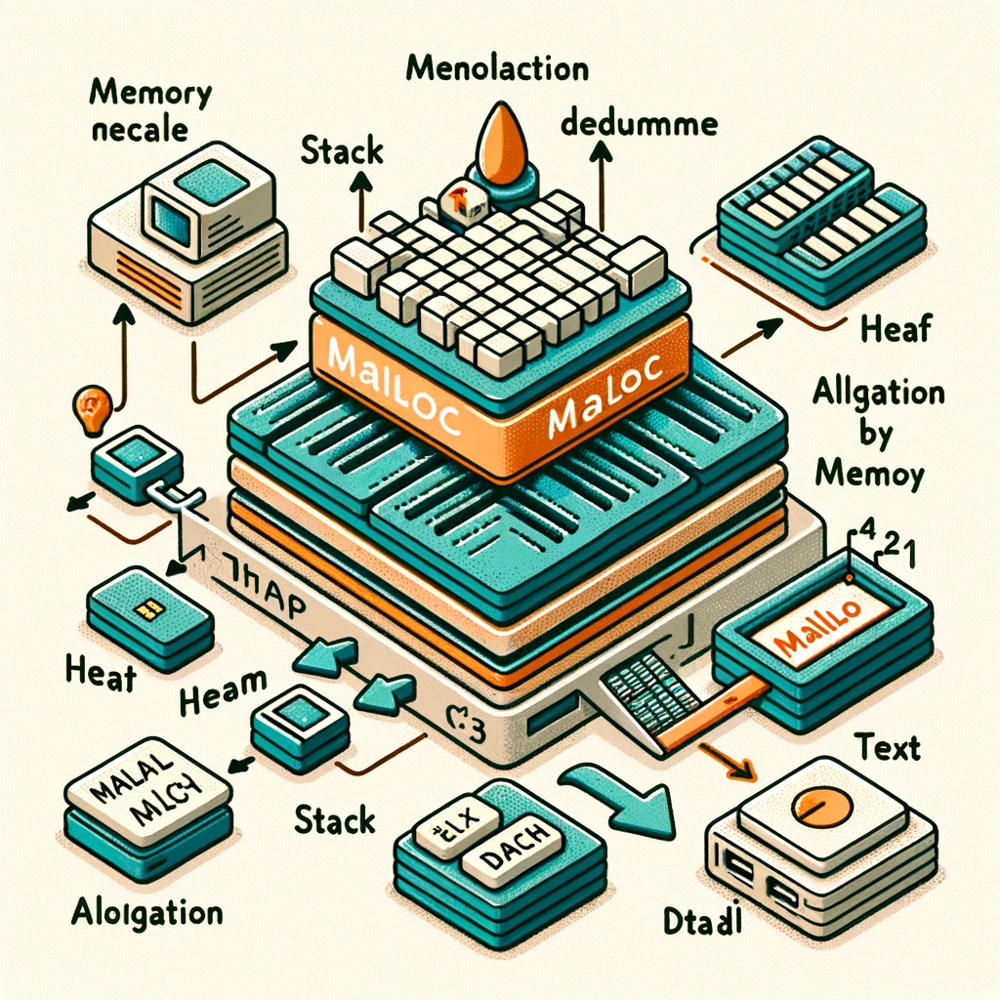

# Malloc

---

## Objective: Cover about background and origin of malloc, how to use it and the some exercises to practice.

<div>
  
</div>

### What is malloc?

`malloc` stands for memory allocation, it allocates a specified number of bytes of memory and returns a pointer to the first byte of this memory block. Here's the syntax:

```
void *malloc(size_t size);
```

- `size_t size`: The number of bytes to allocate;
- returns: a pointer to the allocated memory, or `NULL` if the allocation fails.

### When and How to use `malloc`

Use `malloc` when the amount of memory needed isn't known until runtime. It's crucial in situations like handling variable-sized data structures.

#### Good Practices:

- Always check if `malloc` returns `NULL` (memory allocation fails).
- Always free the allocated memory using `free()` to avoid memory leaks.

## Exercises

- Program to calculate the sum of n numbers entered by the user
